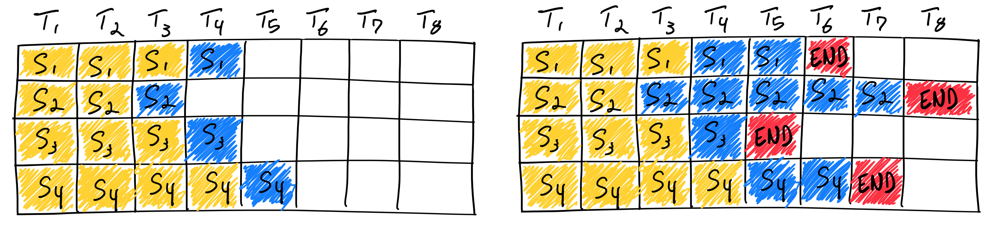

## Optimizing NNs for inference

#### 1. Decoder-only inference

-   GPT-like models are decoder-only models
-   No encoder, no encoder-decoder multi-head attention
-   Input processing (aka **prefill**): highly parallel
    -   Inputs (the tokenized prompt) are embedded and encoded
    -   Mult-head attention computes the keys and values (KV)
    -   Large matrix multiplication, high usage of the hardware accelerator
-   Output generation: sequential
    -   The answer is generated **one token** at a time
    -   Each generated token is **appended** to the previous input
    -   The process is repeated until the stopping criteria is met (max. length or EOS)
    -   Low usage of the hardware accelerator

#### 2. The KV cache

-   Can we avoid recomputing KV values again and again for the input tokens?
-   We only really need to do it for the token we just generated and appended to the input!
-   The **KV cache** stores the KV values for all previous tokens in the accelerator RAM
-   Of course, this doesn't work for the first token, which is why it takes longer to generate
-   Cache size (FP16) $= 2 \times 2 \times \text{batch\_size} \times \text{seq\_length} \times \text{num\_layers} \times \text{embeddings\_length}$

#### 3. Continuous batching

-   Decoder-only inference requests are harder to batch than for traditional Transformers
-   Input and output lengths can greatly vary, leading to very different generation times

Traditional batching waits for all requests to complete:

-   low hardware usage

Continuous batching evicts completed requests and runs new requests:

-   high hardware usage

Token generation must pause regularly to run prefill for new requests (`waiting_served_ratio` parameter in TGI).

`waiting_served_ratio`

-   控制了系统在高负载情况下的行为，尤其是生成任务排队时的优先级。
-   比例的值定义了 **允许多少等待请求与当前正在被服务的请求相比较**。
-   例如：
    -   值为 `2.0` 表示允许最多两倍于当前服务中的请求排队。
    -   值为 `1.0` 表示等待请求的数量不能超过正在服务中的请求。
    -   值小于 `1.0` 则表示非常严格的排队限制。

#### 4. Speculative decoding

-   The vanilla generation process outputs only one token at a time
-   It's also memory-bound: idle compute resources are available
-   With a small model ($M_q$), we predict several potential completions in parallel (aka speculative sampling)
-   With the large model $M_p$, we evaluate the completions and pick the best one (or correct it)
-   Each iteration generates at least valid token, and potentially more

##### 4.1 Building the small model

-   Select a **small off-the-shelf version** of the large model

-   Use a basic **n-gram model** to generate tokens found in the prompt

    -   Input-grounded tasks (summarization, document QA, multi-turn chat, code editing): **high n-gram overlap** between the input (prompt) and the generated output

    -   We can use strings present in the prompt to generate candidate token sequences

    -   Significant speedups (2x-4x), without model modification and with no effect on output quality

    -   Implemented in the transformers library

        https://github.com/apoorvumang/prompt-lookup-decoding

-   Fine-tune a small model **on top of** a frozen large model
-   Fine-tune the small and large model **together**

##### 4.2 Speculative decoding: Medusa

-   Add decoding heads to the LLM to predict multiple outputs in parallel
-   Verify them simultaneously in each decoding step
-   Two techniques to fine-tune the new heads
    -   MEDUSA-1: find-tune on top of the frozen LLM
        -   Parameter-efficient fine tuning with QLoRA Vicuna 7B, 60k samples: 5 hours on an A100
    -   MEDUSA-2: fine-tune together with the LLM

#### Reference

-   [How continuous batching enables 23x throughput in LLM inference while reducing p50 latency](https://www.anyscale.com/blog/continuous-batching-llm-inference)